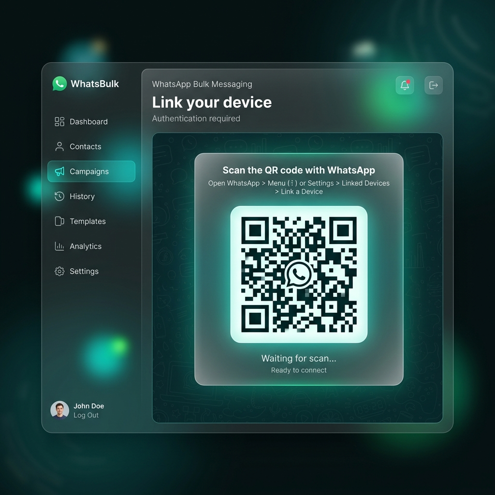
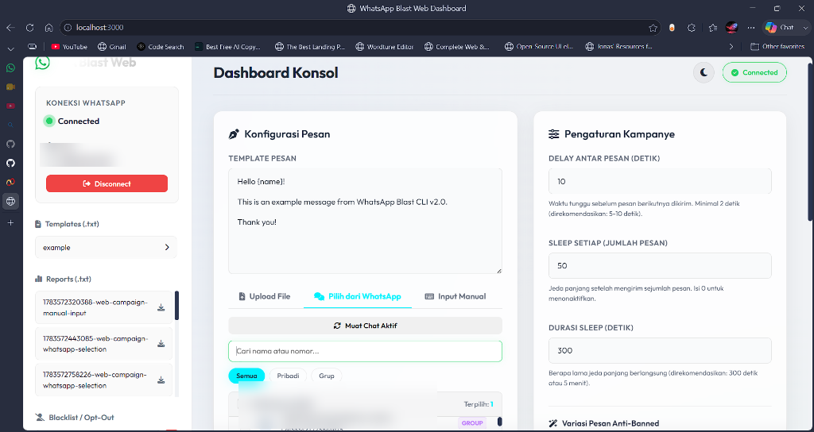

# 📱 WhatsApp Blast Web Dashboard & Consent System

[](https://opensource.org/licenses/MIT)
[](https://nodejs.org/)
[](https://github.com/Waynra/Whatsapp-blast-web)

A premium, modern web dashboard application to manage bulk messaging campaigns on WhatsApp. Equipped with a **Consent Management System (Auto-Blacklist)**, a **non-blocking active WhatsApp chat checklist**, **manual input pasting**, and **anti-spam message variations**.

---

## 📸 Tampilan Dashboard

### 1. Halaman Login QR Code (Tampilan Awal)


### 2. Panel Kontrol Konsol Utama (Sudah Terhubung)


---

## ✨ Features

### 💻 Web Dashboard & Interface
* **Glassmorphic UI**: Sleek, state-of-the-art dark-mode dashboard with neon teal accents.
* **🌗 Theme Switcher**: Toggle instantly between **Dark Mode** and a clean, premium **White (Light) Mode** (persists on reload!).
* **Live Logs Console**: Stream backend activity logs and campaign progress directly to an on-screen scrollable terminal log.
* **Control Actions**: Start, Pause, Resume, or Cancel campaign runs in real-time.

### 📱 Contact Selection Methods
1. **Upload File**: Drag-and-drop or select `.txt` files containing target numbers (format: `phone_number|name` or just `phone_number`).
2. **Pilih dari WhatsApp**: Select from active chats.
   * **Asynchronous LID Resolution**: Automatically converts WhatsApp Linked Identities (`@lid`) to real phone numbers in the background without blocking the UI.
   * **Checklist Selection**: Search by contact name/number, filter by Private vs. Group chats, and select targets with a "Pilih Semua" (Select All) checkbox.
3. **Input Manual**: Direct textarea to paste or type contact numbers on the fly (format: `phone_number|name` or just `phone_number`, one per line).

### 🚫 Consent & Blacklist System (Opt-Out)
* **Keyword Detection**: Listens to incoming replies. If a recipient replies with **`STOP`** in private chat, they are instantly blacklisted.
* **Auto-Reply Unsubscribe Confirmation**: Sends a confirmation message: *"Nomor Anda telah dimasukkan ke daftar blacklist..."*
* **Outbound Prevention**: The core pengirim checks the blacklist before sending. Blacklisted numbers are automatically skipped.
* **Blacklist Manager**: View, manually add, or delete numbers from the blacklist right in the sidebar.

### 🎨 Message Variations Engine (Anti-Ban Safety)
* **Spintax Support**: `{Halo|Hai|Hi} {name}` selects random words for uniqueness.
* **Dynamic Variables**: `{date}`, `{time}`, `{random_string}`, `{random_number}` are auto-replaced with current values.
* **Variation Modes**: Emoji placement, whitespace modifications, and full anti-ban variations (Mode 5).

---

## 💻 Tech Stack

Sistem ini dibangun menggunakan teknologi modern berbasis JavaScript:
*   **Backend (Server Side):**
    *   **Node.js**: Lingkungan runtime JavaScript untuk mengeksekusi aplikasi.
    *   **Express.js**: Web framework minimalis untuk menangani rute REST API HTTP (seperti blacklist, reports, dan templates).
    *   **Socket.io**: Protokol WebSockets untuk memancarkan status QR Code, persentase progress blast, dan log aktivitas ke dashboard secara real-time.
    *   **Multer**: Middleware untuk menangani upload file daftar nomor kontak `.txt`.
    *   **Winston**: Sistem logging untuk merekam log aplikasi ke file lokal (`logs/`).
*   **WhatsApp Automation Core:**
    *   **whatsapp-web.js**: Library utama untuk mengemulasi koneksi ke WhatsApp Web.
    *   **Puppeteer**: Browser Headless Chrome otomatis yang dijalankan di latar belakang oleh `whatsapp-web.js` untuk menghubungkan sesi WhatsApp dan mengirimkan pesan.
*   **Frontend (Dashboard Web):**
    *   **HTML5 & Vanilla CSS3**: Tampilan modern responsif bergaya *Glassmorphic* dengan dukungan *Dark/Light Mode*.
    *   **Vanilla JS (ES6+)**: Menangani interaksi frontend, unggahan file, pemilihan chat, dan pembaruan antarmuka secara asinkron.
    *   **qrcode.js**: Untuk merender teks QR Code dari backend menjadi kode QR visual di web.
    *   **FontAwesome v6**: Penyedia ikon grafis di dasbor.
*   **CLI (Command Line Interface):**
    *   **Chalk**: Pewarna teks keluaran terminal.
    *   **Cli-Progress**: Menampilkan animasi progress bar pengiriman di command line.
    *   **Readline-Sync**: Menangani input tanya-jawab interaktif saat setup aplikasi.

---

## 🛠️ Installation

### Prerequisites
- Node.js >= 16.0.0
- npm or yarn
- Active WhatsApp account

### Steps

1. **Clone the repository**
   ```bash
   git clone https://github.com/Waynra/Whatsapp-blast-web.git
   cd Whatsapp-blast-web
   ```

2. **Install dependencies**
   ```bash
   npm install
   ```

3. **Run setup wizard**
   ```bash
   npm run setup
   ```

4. **Configure environment**
   Edit the `.env` file to customize settings:
   ```bash
   # WhatsApp Configuration
   HEADLESS_MODE=false              # Run browser in headless mode
   DEFAULT_DELAY=3000               # Default delay between messages (ms)
   MAX_RETRY_ATTEMPTS=3             # Number of retry attempts for failed messages
   RETRY_DELAY=5000                 # Delay between retry attempts (ms)
   ```

---

## 🚀 Running the App

### Start the Web Dashboard (Recommended)
Launch the Express & Socket.io server:
```bash
npm start
```
Open your browser and navigate to: **[http://localhost:3000](http://localhost:3000)**.

### Run the CLI Version (Optional)
If you prefer running the original CLI prompts version:
```bash
npm run cli
```

---

## 📂 File Formats (For File Upload / Manual Input)

Format: `phone_number|name` (one per line)
```text
6281234567890|Budi
6281234567891|Andi
6281234567892
```

---

## 📊 Reports & Logs
* **Reports**: Detailed `.txt` campaign logs with statistics are saved automatically in the `./report/` folder and can be listed directly in the sidebar.
* **Logs**: Stored in the `./logs/` folder (`combined.log` and `error.log`).

---

## ⚠️ Disclaimer
This tool is for **educational and legitimate business purposes only**. Sending unsolicited messages may violate WhatsApp Terms of Service, and your account may be banned for spam. Always get consent (Opt-in) before sending bulk messages. Use responsibly.

---

## 📄 License
This project is licensed under the MIT License - see the [LICENSE](LICENSE) file for details.

---

Made with ❤️ by Waynra.